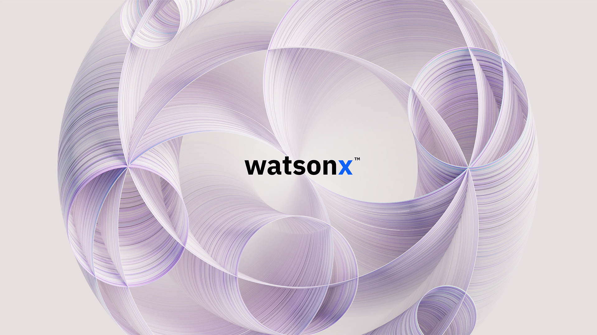
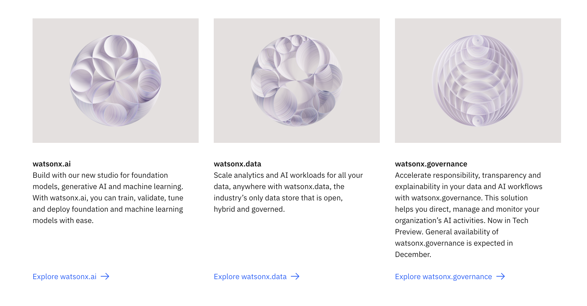
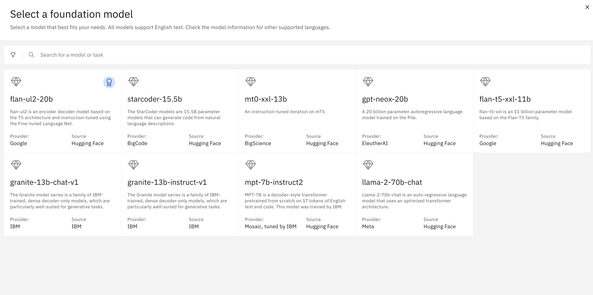
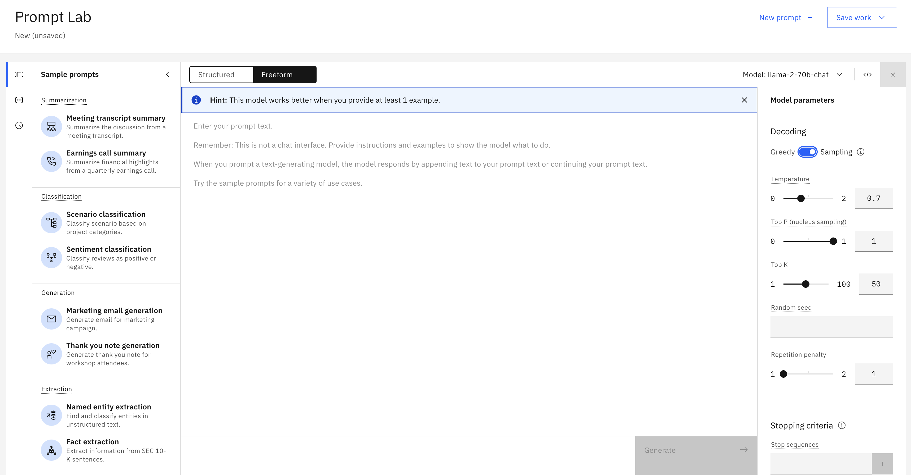
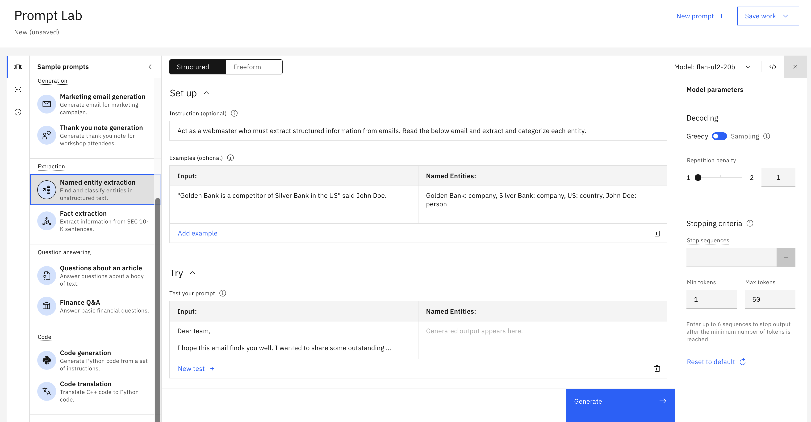

# watsonx

Watsonx is an AI and data platform with a set of AI assistants designed to help you scale and accelerate the impact of AI with trusted data across your business.

The core components include: a studio for new foundation models, generative AI and machine learning; a fit-for-purpose data store built on an open data lakehouse architecture; and a toolkit, to accelerate AI workflows that are built with responsibility, transparency and explainability. 

The watsonx AI assistants empower individuals in your organization to do work without expert knowledge across a variety of business processes and applications, including automating customer service, generating code, and automating key workflows in departments such as HR.

## Platform components

## Foundation Models available in watsonx

## Prompt lab

